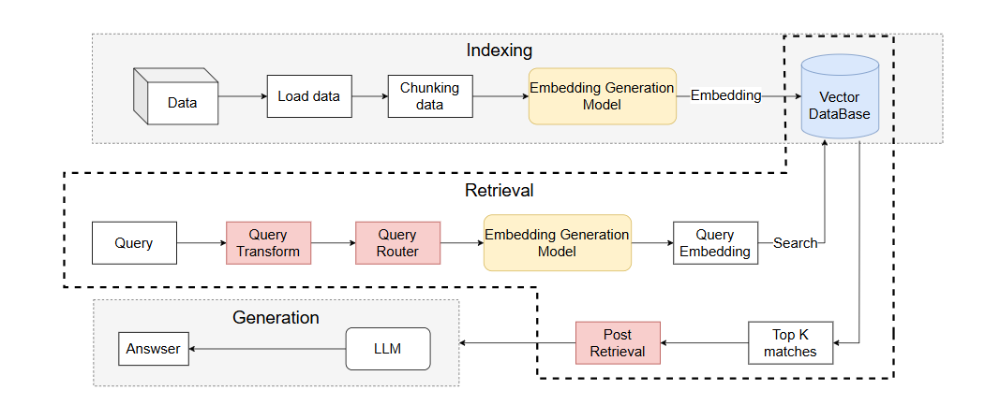
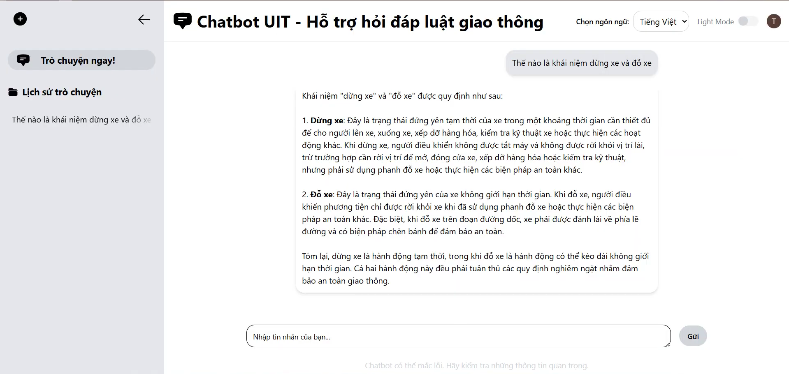
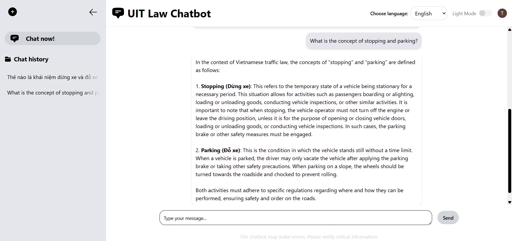

# VNlawchatbot 🚦📘  
Hệ thống hỏi đáp về luật giao thông Việt Nam dựa trên mô hình RAG nâng cao (Advanced Retrieval-Augmented Generation).  
Dự án này được thiết kế nhằm hỗ trợ người dân dễ dàng tra cứu, hiểu và áp dụng các quy định pháp luật về giao thông, với khả năng truy xuất chính xác và trả lời mạch lạc theo ngữ cảnh.

---

## 📚 Bộ Dữ Liệu

Nguồn dữ liệu được thu thập trực tiếp từ trang **vbpl.vn** – Cổng thông tin chính thức của Chính phủ về văn bản quy phạm pháp luật nhằm đảm bảo tính chứng thực và đầy đủ của dữ liệu.
Quy trình xử lý dữ liệu gồm:

- **Thu thập**: Sử dụng trình thu thập dữ liệu để lấy văn bản luật liên quan đến lĩnh vực giao thông (luật, nghị định, thông tư).
- **Tiền xử lý**: Chuẩn hóa văn bản, loại bỏ nội dung trùng lặp, chuyển đổi định dạng HTML/PDF sang plain text.
- **Làm sạch & chuẩn hóa**: Bảo toàn cấu trúc điều/khoản để thuận tiện cho việc chunking và truy vấn.

Chúng tôi thu thập được tổng cộng 779 văn bản quy phạm pháp luật về lĩnh vực giao thông và sau quá trình chunking, chúng tôi thu được 30769 chunks được sử dụng cho quá trình truy xuất của hệ thống. 
Ngoài ra, để phục vụ cho quá trình đánh giá các chunks được hệ thống truy xuất, chúng tôi xây dựng một tập ground truth gồm 100 câu hỏi và các đoạn chunks liên quan đến câu hỏi để thực hiện mục đích này.

---

## 🧠 Hệ Thống Advanced RAG
So với kiến trúc hệ thống truy xuất truyền thống, chúng tôi đề xuất một cơ chế Retrieval nâng cao, trong đó hai mô-đun bổ sung **Query Router** và **Query Transform** — được tích hợp vào pipeline trước bước tính toán  nhằm tối ưu hóa khả năng tìm kiếm và tăng cường độ phù hợp của kết quả truy xuất.
Cụ thể:
- Query Router có chức năng phân loại truy vấn đầu vào thành hai nhóm chính: in-domain và out-of-domain.
- Query Transform đóng vai trò cải thiện biểu diễn ngữ nghĩa của truy vấn bằng cách khai thác ngữ cảnh lịch sử từ các lượt truy vấn trước đó.

### ⚙️ Mô hình hệ thống:

## 🔍 Quy Trình Triển Khai

1. **Chunking**:  
   - Áp dụng **recursive chunking** để chia văn bản pháp luật thành các đoạn có cấu trúc rõ ràng (Điều, Khoản).
   - Mỗi chunk được lưu trữ cùng metadata như số điều, tên luật, năm ban hành.

2. **Embedding**: 
   - Sử dụng hai mô hình embedding là **Halong_embedding** và **Vietnamese PhoBERT base** nhằm so sánh kết quả tạo vector từ cả hai mô hình nhằm đánh giá khách quan chất lượng embedding và hiệu quả của bước truy xuất (Retrieval).

3. **Tìm kiếm truy xuất (Retrieval)**:  
   - Triển khai **Hybrid Search**:  
     - **BM25** để tìm kiếm dựa trên từ khóa.  
     - **Semantic search** để tìm kiếm theo ngữ nghĩa.

4. **Sinh câu trả lời (Generation)**:  
   - Sử dụng mô hình GPT-o3 để kết hợp đoạn văn truy xuất và sinh câu trả lời.  
   - Áp dụng **chain-of-thought prompting** để mô hình lý luận từng bước trước khi đưa ra kết luận cuối cùng.

---

## 📊 Đánh Giá Hệ Thống

Bảng 1: Kết so sánh các phương pháp truy xuất được thực hiện trong quá trình Retrieval sử dụng mô hình Vietnamese PhoBERT base.

| Phương pháp            | Hit@10 | MAP@10 | MRR@10 |
|------------------------|--------|--------|--------|
| BM25                   | 0.7838   | 0.5129   | 0.8021   |
| Semantic search        | 0.7529   | 0.5997   | 0.6592   |
| Hybrid (Semantic search + BM25)  | **0.9649** | **0.7904** | **0.8439** |

Bảng 2: Kết quả so sánh hiệu quá truy xuất hai mô hình Halong_embedding và Vietnamese PhoBERT base sử dụng phương pháp Hybrid.

| Model            | Hit@10 | MAP@10 | MRR@10 |
|------------------------|--------|--------|--------|
| Phobert_base           | **0.9649**   | **0.7904**   | 0.8439   |
| Halong_embedding       | 0.9321   | 0.7525   | **0.8627**   |

---

## 🖥️ Giao Diện Người Dùng

Hệ thống tích hợp một giao diện đơn giản, trực quan:

- Nhập câu hỏi liên quan đến luật giao thông
- Trình bày câu trả lời được sinh từ mô hình
- Cho phép lưu lại lịch sử cuộc trò chuyện
- Tra cứu đa ngôn ngữ: Tiếng Việt và Tiếng Anh

---
